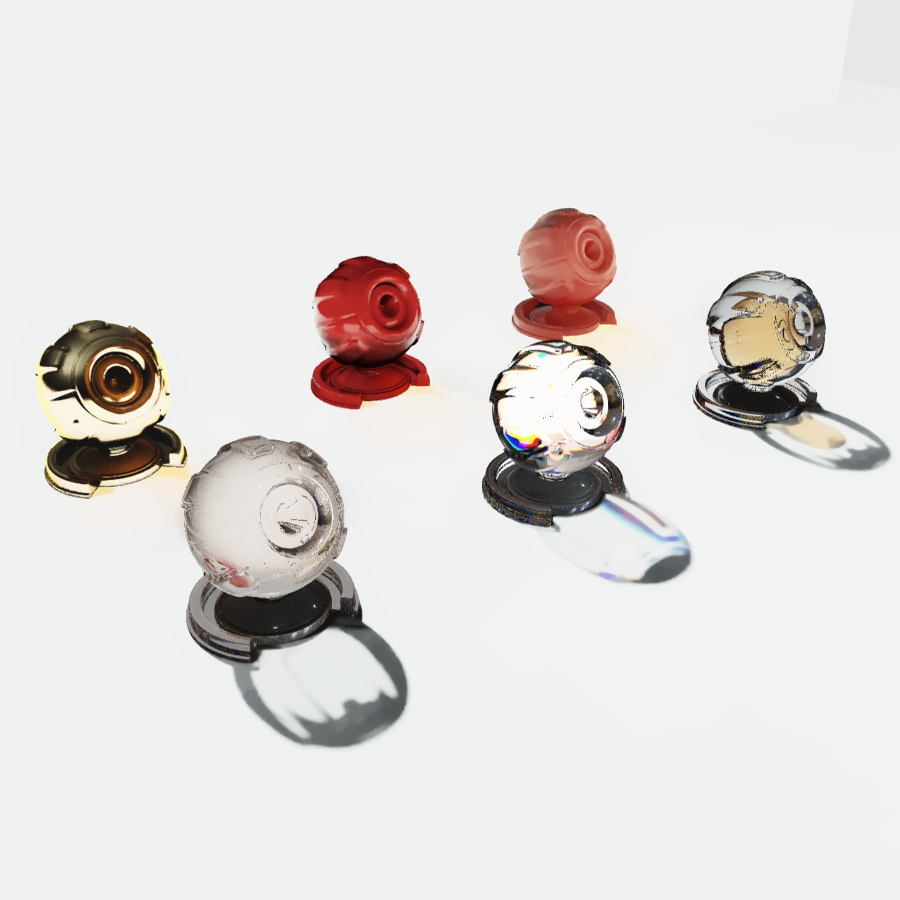
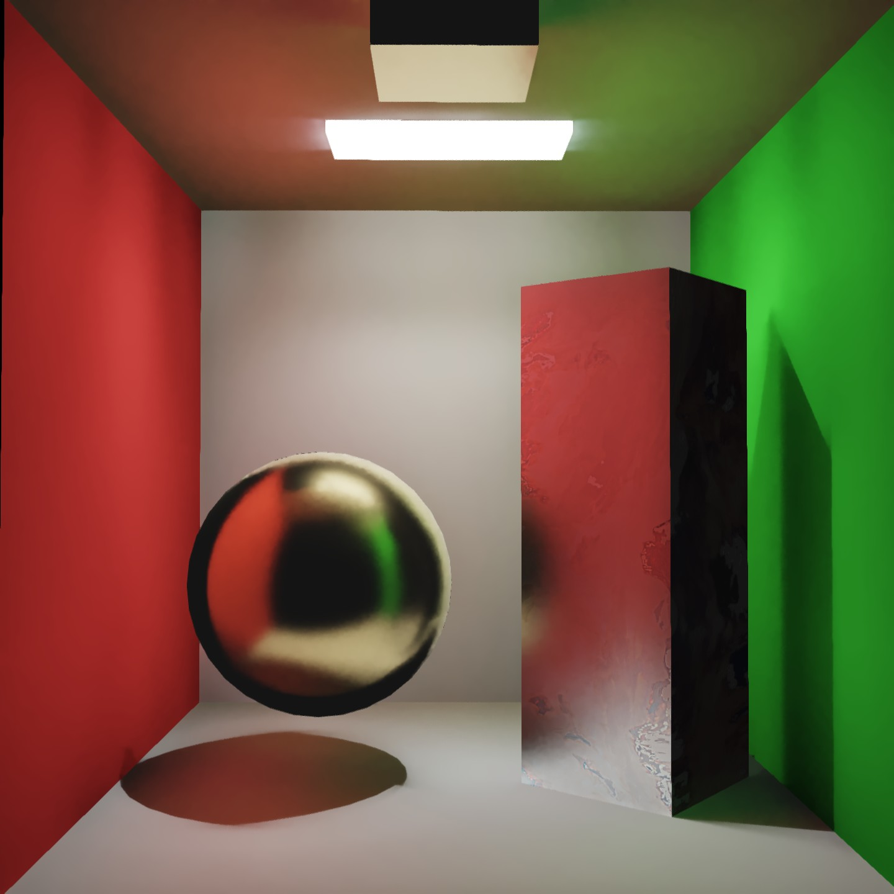
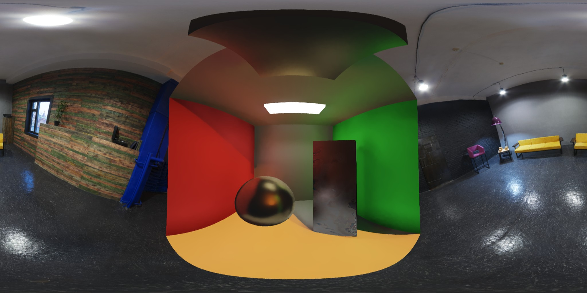
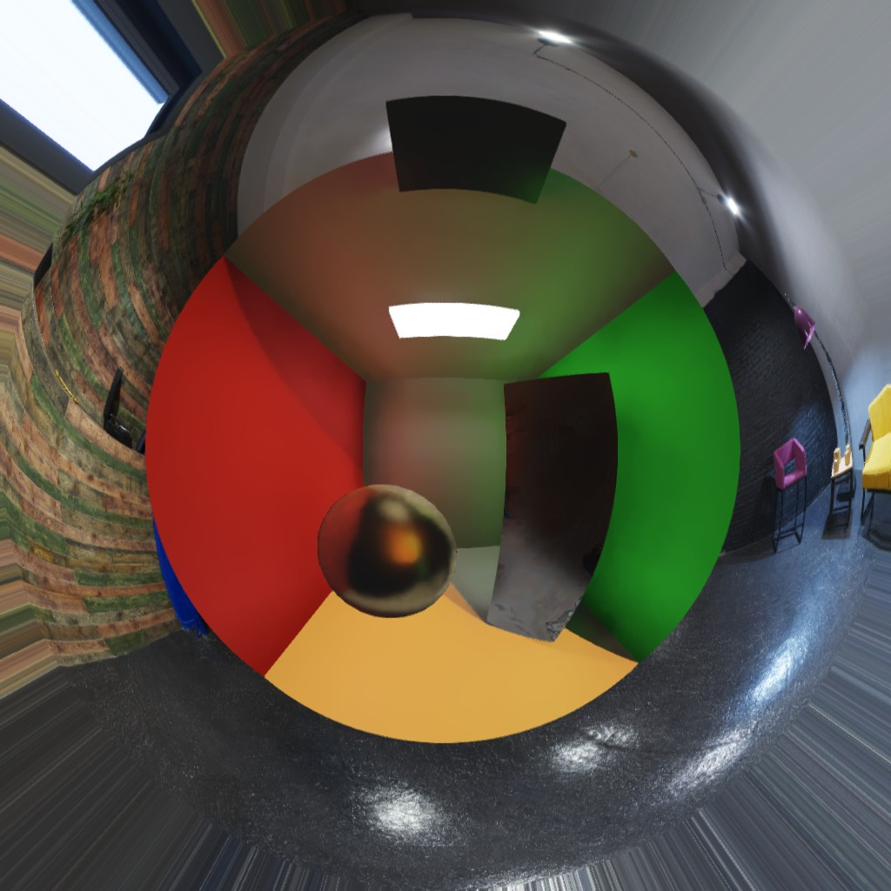

# NewTypeEngine

Real-time path tracing engine for Windows, built on [Cinder](https://github.com/cinder/Cinder) (windowing / display) and [LuisaCompute](https://github.com/LuisaGroup/LuisaCompute) (GPU compute + DSL). It renders production-quality global illumination at interactive rates using **ReSTIR DI / ReSTIR GI** on a **two-pass deferred visibility-buffer pipeline**, with a **ReLAX-style denoiser** on top.

```
┌─────────────────┐     ┌──────────────────────────┐     ┌─────────────────┐
│  LuisaCompute   │────▶│ DxPresent (on-device     │────▶│ Cinder D3D12    │
│  (DX kernels)   │     │ copy into back buffer)   │     │ swap chain      │
└─────────────────┘     └──────────────────────────┘     └─────────────────┘
```

LuisaCompute kernels write into an `Image<float>`; the Luisa device adopts Cinder `RendererD3d12`'s `ID3D12Device` and `DxPresent` copies the tone-mapped frame into the swap-chain back buffer (`src/newtype/core/DxPresent.cpp`). Launch with `--gl` to fall back to the classic DX-GL interop + OpenGL present path — handy for fast GL prototypes, and the way to stay compatible with Cinder blocks that hook the GL renderer (e.g. the Warp block for projection mapping). The app window is a thin shell — all rendering logic lives in the `Pipeline`.

## Gallery







## Features

**Rendering**
- **ReSTIR DI** — reservoir-based direct lighting with light presampling, temporal/spatial reuse and visibility reuse for thousands of emissive triangles.
- **ReSTIR GI** — spatiotemporal reservoir reuse for indirect light, incl. delta-branch handling for metals/glass.
- **SHARC radiance cache** — port of NVIDIA SHARC v1.8.3 (logarithmic voxel hash grid): sparse path-traced update + temporal resolve maintains a world-space surface-incident radiance cache; GI terminates secondary hits on it for converged multi-bounce indirect (incl. behind glass), and the post-denoise glass pass evaluates rough/frosted glass (GGX transmission + reflection taps) and smooth dispersive glass (per-channel replay) against it. See `docs/sharc_rough_glass_plan.md`.
- **ReLAX denoiser** — port of NRD v4.17 ReLAX (prefilter → hit & temporal → atrous → history), with separate specular denoising and disocclusion handling.
- **Two-pass deferred pipeline** — pass 1 traces primary rays into a 20 B/pixel visibility-buffer G-buffer (depth R32F, vis RG32U, barycentrics RG16F, motion RG16F); pass 2 reconstructs positions, interpolates normals/UVs via bindless vertex reads, shades with materials + light sampler, and fires shadow rays. TAA-style Halton jitter is compensated by motion vectors for clean temporal reprojection.
- **Environment maps** — HDR env lighting with importance sampling, mixed with emissive mesh lights.
- **Subsurface scattering** — Burley BSSRDF probe pass plus thin-subsurface path.

**Materials**
- 12 BSDF types: diffuse, conductor (with metal presets), dielectric (incl. nested/thin), plastic, fabric/sheen, clearcoat, subsurface, anisotropic, iridescent, emissive, unlit, null.
- Flat 112-byte `MaterialData` GPU struct with typed CPU param structs and factory functions (`make_diffuse()`, `make_conductor()`, …).
- **4 material layers per mesh** blended by weight (instance buffer packs 4 × 8-bit indices); single-layer meshes take a zero-overhead path.
- Textured materials (albedo/normal/emissive/…) with GPU-compressed texture pipeline, plus custom surface "resolvers" (GPU callables) for procedural shading.

**Scene & engine**
- TLAS/BLAS management with stable `ShapeId` handles; runtime transform / visibility / material / add / remove changes between frames.
- Prototype instancing, deformable meshes (BLAS rebuild on the compute stream), vertex-animation-texture (VAT) meshes, procedural geometry.
- O(1) power-weighted emissive light sampling via alias table (`LightSampler`).
- Injectable render **features** at fixed pipeline points (G-buffer, shade, denoiser, glass tint, tonemap) — shipped with DoF, motion blur, bloom, chromatic aberration, point cloud & trail raster features.
- ImGui-driven UI for nearly every parameter, scene config save/load (JSON), timeline editor with curves/events, DLL hot-reload for runtime shader iteration (`Debug_Runtime` configuration), video player (Media Foundation → D3D11 → Luisa image), movie writer, screenshots and audio.

## Requirements

- Windows 10/11, Visual Studio 2022 (Platform Toolset v143, C++20)
- NVIDIA RTX GPU (the pipeline is built on DX12 ray tracing)
- [Cinder](https://github.com/seph14/Cinder) — please use this fork: it adds the `Debug_MD`/`Release_MD` static-lib configs (dynamic CRT) the engine links, which upstream cinder does not ship
- [LuisaCompute](https://github.com/seph14/LuisaCompute) — please use this fork: it adds the GPU-side BLAS transform-buffer upload (`Accel::set_transform_buffer_on_update`) that the dynamic-geometry / TetCage pipelines rely on. Pre-build it with CMake/MSVC; the project links the **DirectX** backend (raster interop requires it), CUDA toolkit 12.1 is only needed if you also build LuisaCompute's CUDA path
- [LuisaComputeSimulator](https://github.com/LuisaGroup/LuisaComputeSimulator) — cloth physics solver (linked by all configurations)

### External SDKs (git submodules)

The upscaler and spatial-audio backends consume three SDKs under `external/`,
wired as git submodules — after cloning, run:

```bash
git submodule update --init
```

| Path | What it provides | Source |
|------|------------------|--------|
| `external/FidelityFX` | FidelityFX SDK v2.3.0 headers + runtime DLLs — FSR 3.1 upscaler backend (MIT) | [seph14/FidelityFX-dist](https://github.com/seph14/FidelityFX-dist), a vendored dist of [GPUOpen-LibrariesAndSDKs/FidelityFX-SDK](https://github.com/GPUOpen-LibrariesAndSDKs/FidelityFX-SDK) tag `v2.3.0` |
| `external/NVIDIA/DLSS` | NGX headers, stub libs, feature DLLs — DLSS-SR + Ray Reconstruction backends | [NVIDIA/DLSS](https://github.com/NVIDIA/DLSS) tag `v310.9.1` (cloning it means you accept NVIDIA's RTX SDK license) |
| `external/Valve/SteamAudio` | Steam Audio v4.8.1 phonon C API — HOA ambisonics + HRTF binaural spatial audio (Apache-2.0) | [seph14/SteamAudio-dist](https://github.com/seph14/SteamAudio-dist), a vendored dist of the [ValveSoftware/steam-audio](https://github.com/ValveSoftware/steam-audio) `v4.8.1` release asset |

Post-build events copy the FidelityFX / NGX / phonon runtime DLLs next to the
engine exe; the paths are wired in `vc2022/NewTypeEngine.props`.

## Building

1. **Clone the dependencies** and note their locations:

   ```bash
   git clone https://github.com/seph14/Cinder
   git clone https://github.com/seph14/LuisaCompute
   git clone <this repo>
   ```

2. **Build LuisaCompute** with CMake (MSVC, x64) and **build Cinder** per its docs.

3. **Configure paths** in `vc2022/NewTypeEngine.props`:

   ```xml
   <CinderRoot>C:\path\to\Cinder</CinderRoot>
   <LuisaComputeRoot>C:\path\to\LuisaCompute</LuisaComputeRoot>
   <LCSRoot>C:\path\to\LuisaComputeSimulator</LCSRoot>
   ```

   The props file expects LuisaCompute's libs under `<LuisaComputeRoot>\build-dx[-debug]\{lib,bin}` — adjust `LuisaComputeLib*`/`LuisaComputeBin*` if you use different build directories.

4. **Build and run**:

   ```bash
   msbuild vc2022/NewTypeEngine.sln /p:Configuration=Release /p:Platform=x64
   ```

   or open `vc2022/NewTypeEngine.sln` in Visual Studio and build `Release | x64`. The post-build step copies the Cinder/LuisaCompute DLLs next to the exe. The exe must be able to find the `assets/` folder (models, textures, HDR envmaps, configs) — run it from the repository root or set the debugger working directory accordingly.

Feature toggles live in [`include/newtype/core/Config.h`](include/newtype/core/Config.h) (`NT_ENABLE_GI`, `NT_ENABLE_DENOISER`, `NT_ENABLE_SHARC`, `NT_ENABLE_DISPERSION`, …) — use `#if`, never `#ifdef`.

### Configurations

| Config | What it is |
|--------|------------|
| `Debug` / `Release` | The dev app, engine sources compiled into the exe (static /MD(d) cinder). |
| `Debug_Runtime` | Debug + shader-DLL hot reload (`RT_RUNTIME`): runtime shader DLLs and the custom-material callable DLL are loaded and rebuilt on source change. Links exactly like Debug (all configs use static cinder — shared cinder never exported the D3D12 renderer). |
| `NewTypeEngineLib` | The prebuilt static library project (ActiveCfg-only in the solution; built by `tools/package_dist.py`). |

## Using the engine in your own project

The fastest route is the prebuilt library: package a self-contained distro
(static engine lib + headers + cinder + LuisaCompute DLLs + FidelityFX), then
scaffold a project that compiles only its own `App.cpp`:

```bash
python tools/package_dist.py --verify                # builds lib + assembles dist/ + smoke test
python tools/generate_project.py --path D:/Projects --name MyDemo   # links the prebuilt lib (default)
```

`--engine source` instead copies the whole engine tree into the project for
free modification (the previous behaviour). See
[`docs/prebuilt_dist.md`](docs/prebuilt_dist.md) for the distro layout, the
frozen-macro/ABI-fingerprint policy, and the packaging how-to.

## Sample scenes

The app ships with three self-contained scenes in [`src/tests/`](src/tests). Pick one at launch — **no recompile needed** — and the active scene is shown in the window title:

```bash
NewTypeEngine.exe --scene cornell    # Cornell box, animated glass + occluder
NewTypeEngine.exe --scene material   # material sphere grid (default)
NewTypeEngine.exe --scene room       # furnished interior, glass/metal/fabric
```

| Scene | File | What it exercises |
|-------|------|-------------------|
| `material` | [`MaterialTest.cpp`](src/tests/MaterialTest.cpp) | 5 × 3 sphere grid (diffuse, conductor, subsurface, glass, fabric) with clearcoat / sheen **material layers** on columns 2–3, textured materials, warm area light. The ImGui *"Move Spheres"* checkbox animates the rows — good for watching temporal accumulation and ReSTIR reuse under motion. |
| `cornell` | [`CornellBox.cpp`](src/tests/CornellBox.cpp) | Classic red/green Cornell box with a checker-material cube (clearcoat layer), gold sphere, refractive glass cube and an **orbiting occluder** — hard test for temporal reuse + shadows under animation. |
| `room` | [`Room.cpp`](src/tests/Room.cpp) | Full interior: glass panels, gold metal, carpet, chairs, emissive room light — color bleeding, mixed rough dielectrics/conductors, small bright light shadows. |

Each scene is a small `TestScene` subclass (`build()` / `update()` / `drawUi()`); see [`src/tests/TestScenes.h`](src/tests/TestScenes.h) to add your own and register it in `createScene()`.

**Controls**: `Space` pause/resume animation · `C` toggle camera orbit · mouse drag / wheel to move · `F` fullscreen · `S` screenshot · `Ctrl+S` save scene config · `U` toggle UI · `Esc` quit.

## Architecture

### Frame flow

```
setup()        Renderer (interop) → Pipeline (shaders, G-buffer, accumulation)
               → scene build: materials → shapes/lights → buildScene() (TLAS + LightSampler)
per frame      update(time, dt)            transforms, visibility, deformables, light sampler
               beginFrame(renderer)        acquire interop texture, sync previous frame
               render(renderer, camera)    G-buffer pass → shading (ReSTIR DI/GI) → denoiser → features
               endFrame()                  present via Cinder
```

### Two-pass deferred pipeline

```
Pass 1: G-Buffer (mGBufShader)           Pass 2: Deferred Shading (mDeferredShader)
┌──────────────────────┐                 ┌──────────────────────────────────┐
│ Trace primary rays   │                 │ Read visibility buffer           │
│ ↓                    │                 │ ↓                                │
│ Write 20B/pixel:     │──── G-Buffer ──▶│ Reconstruct world position       │
│  depth (R32F)        │                 │ ↓                                │
│  vis   (RG32U)       │                 │ Read vertex data via bindless    │
│  bary  (RG16F)       │                 │ ↓                                │
│  motion(RG16F)       │                 │ Interpolate normals/UVs          │
└──────────────────────┘                 │ ↓                                │
                                         │ Material lookup + LightSampler   │
                                         │ ↓                                │
                                         │ Shadow rays + temporal accum     │
                                         └──────────────────────────────────┘
```

### Core components

| Component | Source | Purpose |
|-----------|--------|---------|
| `Renderer` | `src/newtype/core/Renderer.cpp` | LuisaCompute device/stream context, DX↔GL interop texture, double-buffered frame resources |
| `Pipeline` | `src/newtype/core/Pipeline*.cpp` | Scene ownership, pass orchestration (DI/GI/denoiser), accumulation, config |
| `Geometry` | `src/newtype/scene/Geometry.cpp` | TLAS/BLAS management, instance buffer, bindless vertex/triangle arrays |
| `MaterialPool` | `src/newtype/render/MaterialPool.cpp` | 256-material pool, typed union `MaterialData`, texture bindless |
| `LightSampler` | `src/newtype/render/LightSampler.cpp` | Alias table, O(1) power-weighted emissive triangle sampling |
| `PassDI` / `PassGI` | `src/newtype/core/` | ReSTIR direct / global illumination passes |
| `PassDenoiser*` | `src/newtype/core/` | ReLAX denoiser stages |
| `MeshShape` / `LightShape` | `src/newtype/scene/` | Indexed meshes with 4-layer material system; emissive light shapes |
| `Camera` | `src/newtype/util/Camera.cpp` | Camera with motion vectors for temporal reprojection |
| `IFeature` | `src/newtype/feature/` | Pluggable passes injected at `FeaturePoint`s |
| `ShaderManager` | `src/newtype/core/ShaderManager.cpp` | DLL hot-reload for runtime shader editing |

### Instance buffer (uint4 per instance)

```
.x = properties (flags)
.y = material_layers (4 × 8-bit material indices, layer 0 = base)
.z = vertex_buffer_bindless_slot
.w = triangle_buffer_bindless_slot
```

### Feature injection points

Custom passes plug into the frame at fixed points via `Pipeline::addFeature()`:

| `FeaturePoint` | Sees | Typical use |
|----------------|------|-------------|
| `AfterGBuffer` | depth, vis, normals, motion | SSAO, depth grabs |
| `AfterShade` | raw diffuse + specular buffers | lighting viz, custom AO |
| `AfterDenoiser` | denoised HDR | DoF, motion blur, grading |
| `AfterGlassTint` | HDR incl. OIT particles + glass tint | bloom, post-glass effects |
| `AfterToneMap` | LDR display target | overlays, film grain |

Features at the same point run FIFO in registration order; last writer to the render target wins.

### DSL kernel conventions

- Include Cinder headers **before** CUDA/Luisa headers (Windows/GL macro conflicts — enforced in `LuisaGLInterop.h`); the project requires `WIN32_LEAN_AND_MEAN` and `NOMINMAX`.
- Use `camera->generate_ray(...)`, `BindlessVar` for kernel parameters, namespace-qualified DSL math (`luisa::compute::fract()`), `luisa::make_float3()` to avoid Cinder `vec3` ambiguity.
- Image `.read()` always returns `Float4`/`UInt4`; `.write()` always takes `make_float4(...)` — channels are truncated on the GPU.

## Project layout

```
include/newtype/    engine headers (core/, render/, scene/, feature/, util/, …)
src/NewTypeEngine.cpp   Cinder app: window, frame loop, UI, scene selection
src/tests/          sample scenes (CornellBox, MaterialTest, Room) + TestScenes.h
src/newtype/        engine implementation (mirrors include/)
runtime_shaders/    standalone shader projects (hot-reloadable in Debug_Runtime)
assets/             models (OBJ/VAT), textures, HDR envmaps, configs, audio
docs/               design notes: pipeline, ReSTIR/denoiser analyses, material layers, …
vc2022/             Visual Studio solution + property sheets (EngineCommon.props = central compile blob)
vc2022/NewTypeEngineLib/  prebuilt static-library project (packaged by tools/package_dist.py)
```

## Documentation

Feature guides and examples live in [`docs/`](docs):

- [`docs/tetcage.md`](docs/tetcage.md) — TetCageGeometry: animated tetrahedral-cage deformation (`.tetcage` files built with the [TetCage tool](https://github.com/seph14/NewTypeEngine_Toolings))
- [`docs/instancedmesh.md`](docs/instancedmesh.md) — InstancedMesh shared-BLAS instancing, incl. GPU-owned instance transforms
- [`docs/procedural_mesh.md`](docs/procedural_mesh.md) — ProceduralGeometry deformable mode
- [`docs/pointcloud.md`](docs/pointcloud.md) — point-cloud plugin
- [`docs/trail.md`](docs/trail.md) — trail feature
- [`docs/physics.md`](docs/physics.md) — cloth / soft body / rigid body via LuisaComputeSimulator
- [`docs/Timeline.md`](docs/Timeline.md) — timeline editor examples
- [`docs/MaterialExample.md`](docs/MaterialExample.md) — material & texture examples
- [`docs/custom_material_callables.md`](docs/custom_material_callables.md) — custom material GPU callables
- [`docs/HotReloadShader.md`](docs/HotReloadShader.md) — hot-reload shader workflow
- [`docs/prebuilt_dist.md`](docs/prebuilt_dist.md) — prebuilt engine library: distro layout, frozen-macro/ABI policy, packaging

## License

MIT.
